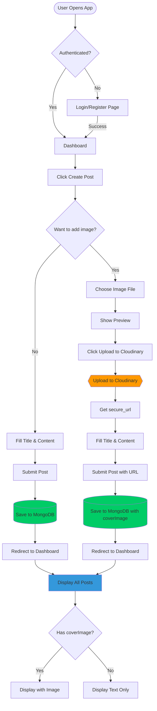
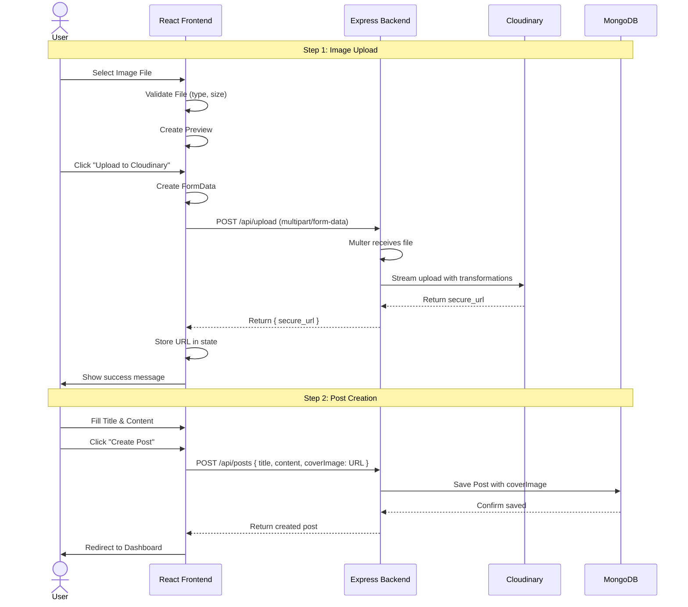
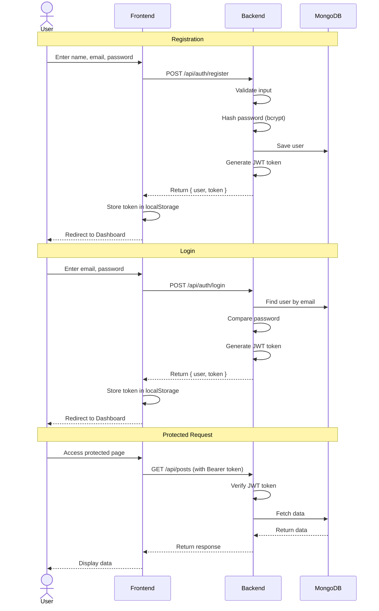
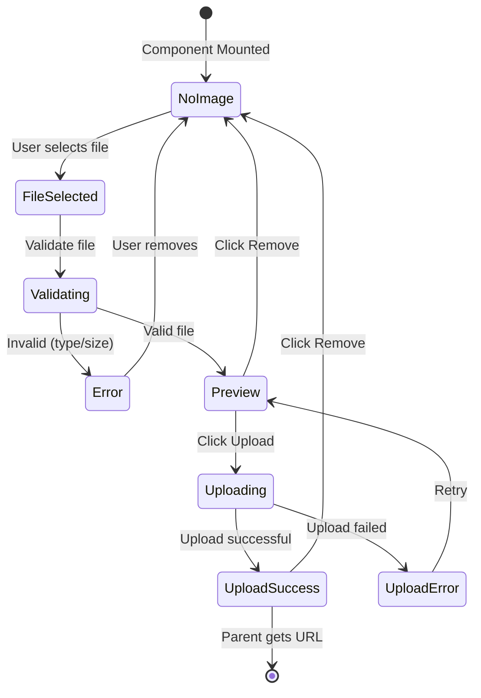
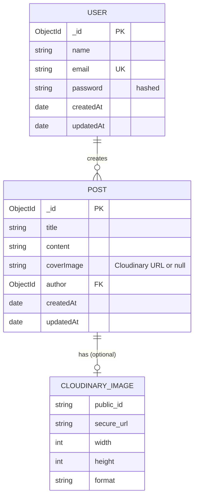
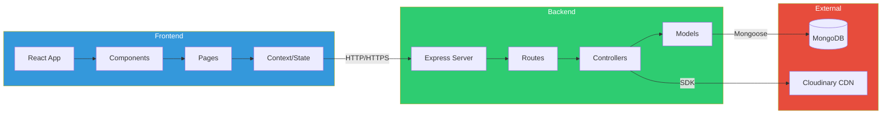
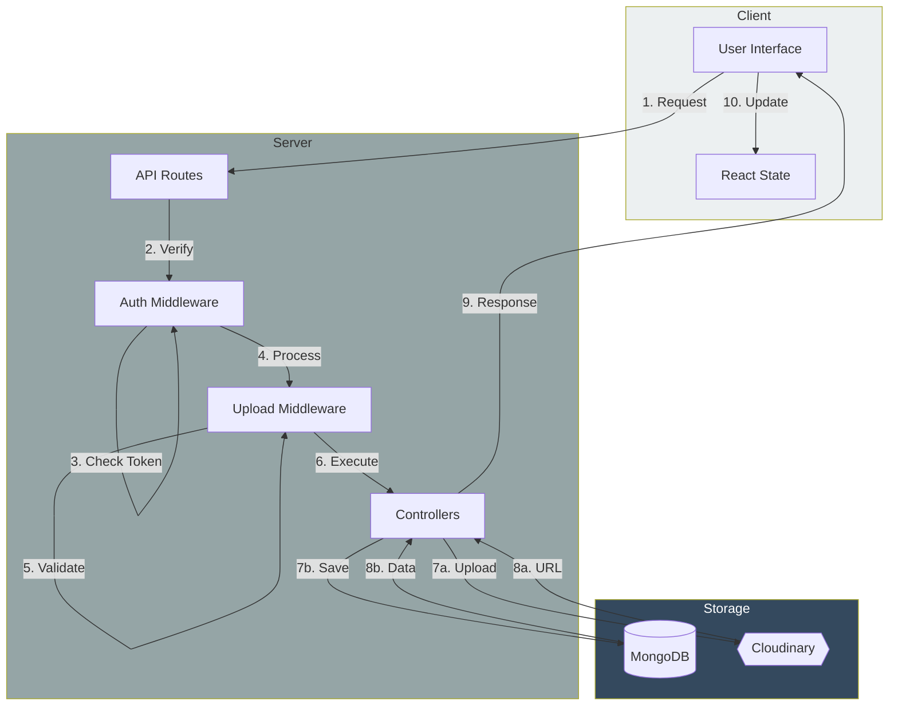
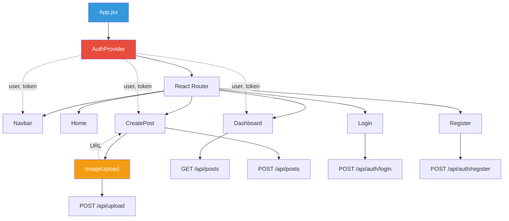
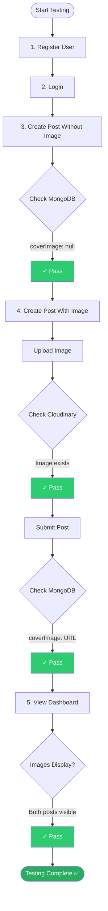

# Visual Workflow Diagrams

## 🎯 Complete System Workflow

## 📤 Two-Step Upload Flow

## 🔐 Authentication Flow

## 🖼️ Image Upload Component Flow

## 📊 Data Structure Relationships

## 🏗️ System Architecture

## 🔄 Request-Response Cycle

## 📱 Component Interaction

## ✅ Testing Flow

---

## 📖 How to Use These Diagrams

These diagrams visualize:

1. **Complete System Workflow** - Overall user journey
2. **Two-Step Upload Flow** - Detailed sequence of image upload
3. **Authentication Flow** - User registration and login
4. **Image Upload Component** - State machine of upload component
5. **Data Relationships** - Database schema relationships
6. **System Architecture** - High-level system structure
7. **Request-Response Cycle** - API communication flow
8. **Component Interaction** - React component hierarchy
9. **Testing Flow** - Testing procedure

To view these diagrams:
- GitHub automatically renders mermaid diagrams in markdown
- VS Code: Install "Markdown Preview Mermaid Support" extension
- Online: Copy to https://mermaid.live/

---

*These diagrams complement the written documentation and provide visual understanding of the system.*
